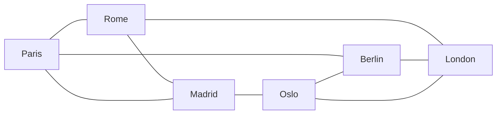

# Undirected Graph, Triangular Prism, and Self-Avoiding Route

## The problem with directed edges

Stage 0 authored connections as directed pairs (`from`/`to`). Every edge was entered twice — once each way — and the escape connection leaked through the client filter unless explicitly excluded. The real problem was conceptual: the game has no one-way routes, so modelling them as directed was the wrong abstraction from the start. Symmetric edges live longest.

## Undirected pairs

Connections are now authored once as an unordered pair:

```toml
connections = [
  ["paris", "berlin"],
  ["rome",  "london"],
]
```

The loader reads these into `LocationGraph.connections: list[list[str]]`. The `neighbors()` method expands them at query time — when asked for Paris's neighbours it walks the pair list and returns the other endpoint of every pair that contains Paris. The escape node simply has no pairs, so its neighbour list is always empty; no special-casing needed.

## The triangular prism

Stage 0's four-city cycle was replaced with a **triangular prism** — two triangles (Paris—Rome—Madrid and Berlin—London—Oslo) joined by three rungs (Paris—Berlin, Rome—London, Madrid—Oslo). Every location has exactly three neighbours.



The prism matters for winnability. The Stage-1 detective starts one step behind the fugitive on a graph they cannot see. On a simple cycle you can only trail; on a 3-regular graph you can go the other way around. The prism is the smallest symmetric graph that guarantees a second path to any node.

## Self-avoiding walk

The Stage-0 route generator used a greedy "first unvisited neighbour" walk — fine on a directed cycle but it dead-ends immediately on any node with degree > 1. The replacement is a **seeded self-avoiding walk**:

```python
while True:
    candidates = [
        n for n in graph.neighbors(current)
        if n not in route and n != escape.id
    ]
    if not candidates:
        break
    current = rng.choice(candidates)
    route.append(current)

route.append(escape.id)
```

When the walk gets stuck it stops and appends the escape terminus. Routes vary in length naturally — on a 3-regular prism the walk visits between 5 and 6 locations before getting stuck, which means each case has a different number of days, making repetition less predictable. The walk never errors because "no candidates" is a valid terminal condition.

## API surface

`POST /cases` no longer returns a `connections` list. Instead, each location carries its own `neighbors` array:

```json
{ "id": "paris", "name": "Paris", "neighbors": ["rome", "madrid", "berlin"] }
```

The client gets everything it needs to render the graph without a separate pass to reconstruct adjacency from edge tuples.
